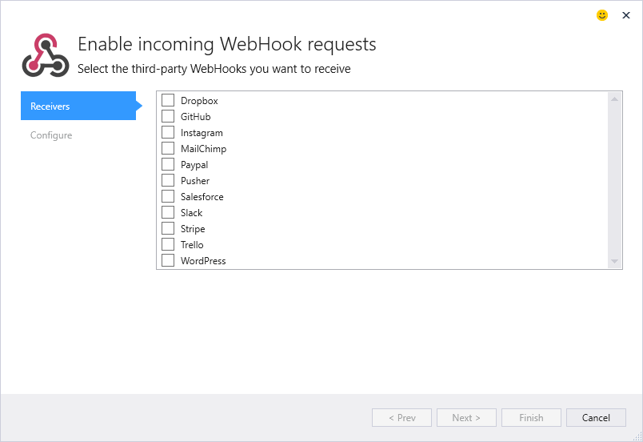
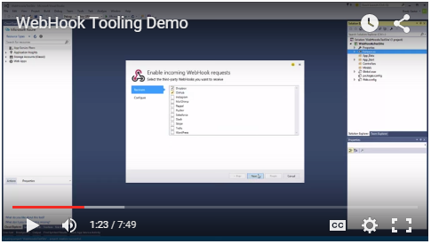

## ASP.NET WebHooks

This repository contains the source code for the ASP.NET WebHooks Visual Studio tools. Written as a Connected Service wizard, the WebHooks tools allow you to select which WebHooks you plan on honoring, and scaffolds code into your project for getting started quickly. A screenshot of the Wizard is below, showing the list of supported WebHooks.

Here's a 7-minute video demonstration of the extension in use. In the demo, I create a simple ASP.NET Web Application that answers incoming GitHub and Dropbox WebHook requests.

### What does it do?
For each WebHook selected, code is generated into to your ASP.NET project to enable the reception of incoming WebHooks. All of the required NuGet dependencies are installed by the tools. Once you run the WebHook Wizard, you'll have boilerplate code so that you can begin processing incoming WebHooks from providers like GitHub, Dropbox, and WordPress using your own custom C# code. 

### Relevant Links
The resources below will provide you more info on ASP.NET WebHooks:

- [Introducing the ASP.NET WebHooks Preview](blogs.msdn.com/b/webdev/archive/2015/09/04/introducing-microsoft-asp-net-webhooks-preview.aspx)
- [Video Demo](https://www.youtube.com/watch?v=gbr-wZVl6d4)
- 
Test
